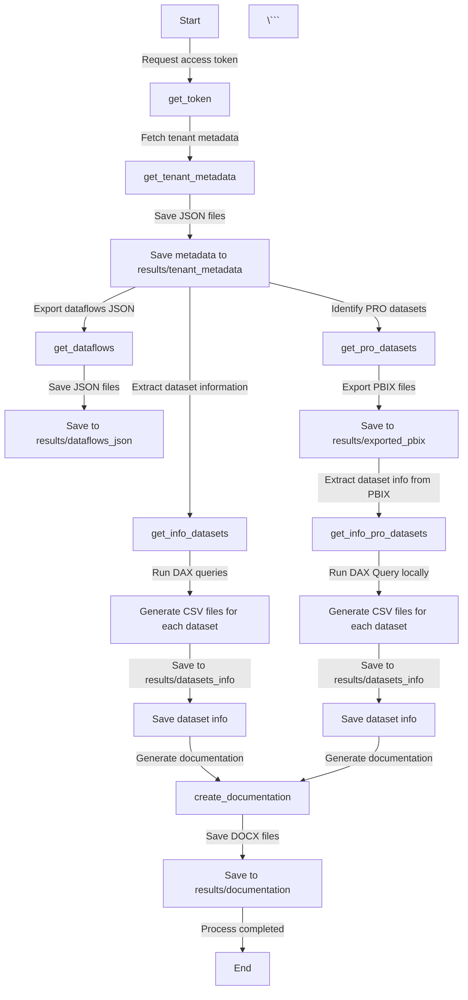
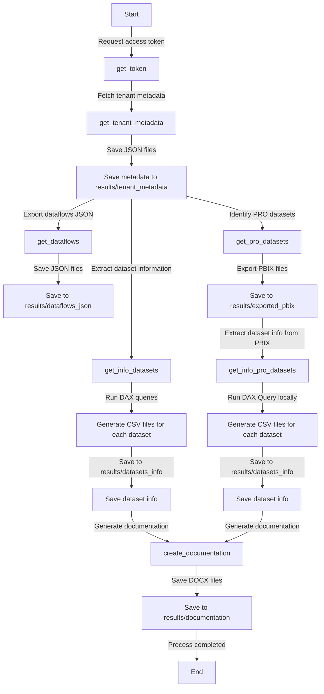

# Markdown

Markdown é uma linguagem de marcação comumente usada para formatar arquivos readme, escrever mensagens em fóruns de discussão online e criar texto rico usando um editor de texto simples.

Benefícios do uso do Markdown incluem:

- Fácil de aprender e usar
- Fácil de ler em sua forma bruta
- Flexível e extensível
- Universalmente suportado em muitas plataformas e aplicações

Confira aqui a documentação sobre Markdown no GitHub: [Getting started with writing and formatting on GitHub](https://docs.github.com/en/get-started/writing-on-github/getting-started-with-writing-and-formatting-on-github/quickstart-for-writing-on-github)  

# Títulos  

> [!NOTE]  
> Use hashtags para alterar o nível de cada título.  

Entrada:  
`### Este é um título nível 3`  

Saída: 
### Este é um título nível 3 
<br> 

# Título Nível 1
## Título Nível 2
### Título Nível 3
#### Título Nível 4
##### Título Nível 5
###### Título Nível 6

<br>  

# Estilos
|Estilo            |Entrada                                               |Saída                                              |
|------------------|------------------------------------------------------|---------------------------------------------------|
|Negrito           |`Este é um texto **em negrito**`                      |Este é um texto **em negrito**                     |
|Itálico           |`Este é um texto *em itálico*`                        |Este é um texto *em itálico*                       |
|Negrito Itálico   |`Este é um texto ***em negrito e itálico***`          |Este é um texto ***em negrito e itálico***         |
|Tachado           |`Este é um texto ~~tachado~~`                         |Este é um texto ~~tachado~~                        |
|Subscrito         |`Este é um texto com <sub>subscrito</sub>`            |Este é um texto com <sub>subscrito</sub>           |
|Sobrescrito       |`Este é um texto com <sup>sobrescrito</sup>`          |Este é um texto com <sup>sobrescrito</sup>         |
|Sublinhado        |`Este é um texto <ins>sublinhado</ins>`               |Este é um texto <ins>sublinhado</ins>              |

# Citações

Entrada:  
`> Esta é uma citação`

Saída:  
> Esta é uma citação

# Links  

Entrada:  
`[Visite este README](https://github.com/alisonpezzott/markdown-tips/main/README.md)`  

Saída:  
[Visite este README](https://github.com/alisonpezzott/markdown-tips/main/README.md)  

# Imagens  

Entrada:  
``  

Saída:  


# Alertas

Entrada:  
```
> [!NOTE]  
> Informações úteis que os usuários devem saber, mesmo ao passar rapidamente pelo conteúdo.
```

Saída:  
> [!NOTE]  
> Informações úteis que os usuários devem saber, mesmo ao passar rapidamente pelo conteúdo.
<br>

Entrada:  
```
> [!TIP]  
> Conselhos úteis para fazer as coisas de forma melhor ou mais fácil.
```

Saída:  
> [!TIP]  
> Conselhos úteis para fazer as coisas de forma melhor ou mais fácil.
<br>
  
Entrada:  
```
> [!IMPORTANT]  
> Informações chave que os usuários precisam saber para alcançar seu objetivo.
```

Saída:  
> [!IMPORTANT]  
> Informações chave que os usuários precisam saber para alcançar seu objetivo.

<br>  

Entrada:  
```
> [!WARNING]  
> Informações urgentes que exigem atenção imediata do usuário para evitar problemas.
```

Saída:  
> [!WARNING]  
> Informações urgentes que exigem atenção imediata do usuário para evitar problemas.

<br>    

Entrada:  
```
> [!CAUTION]  
> Avisos sobre riscos ou resultados negativos de determinadas ações.
```

Saída:  
> [!CAUTION]  
> Avisos sobre riscos ou resultados negativos de determinadas ações.

<br>    

# Tabelas

|Projeto            |Status      |Percentual|
|:------------------|:----------:|---------:|
|Contrução do site  |Em andamento|85%       |
|Gravação do curso  |Congelado   |50%       |
|Revisão da mentoria|Concluído   |100%      |

# Badges  

Badges são cards que podem possuir ícones, textos, links e algumas estatísticas que são resultado de alguma API.  
Veja abaixo alguns badges de exemplo.  

Input:  
``  
Output:  


Input:  
`[GitHub forks](https://img.shields.io/github/forks/alisonpezzott/pbi-docs?style=flat&color=blue&link=https%3A%2F%2Fgithub.com%2Falisonpezzott%2Fpbi-docs%2Fedit%2Fmain%2F`     

Output:  
  

Input:
`[](https://github.com/alisonpezzott)`  

Output:  
[](https://github.com/alisonpezzott)  


Input:  
`[](https://discord.gg/sJTDvWz9sM)`  
Output:  
[](https://discord.gg/sJTDvWz9sM)

Visit [https://img.shields.io/](https://img.shields.io/) for more examples.  


# Fluxogramas   

Podemos criar diagramas Mermaid para demonstrar o fluxo de algum processo como o exemplo abaixo:  

Input:  
```


Output:  

